# E-Commerce Application

This is a comprehensive e-commerce application with integrated MongoDB, Redis, Stripe payment, robust authentication, admin dashboard, sales analytics, and much more. The application follows a modern tech stack, using Node.js, Express, MongoDB, Redis, and Tailwind CSS for design.

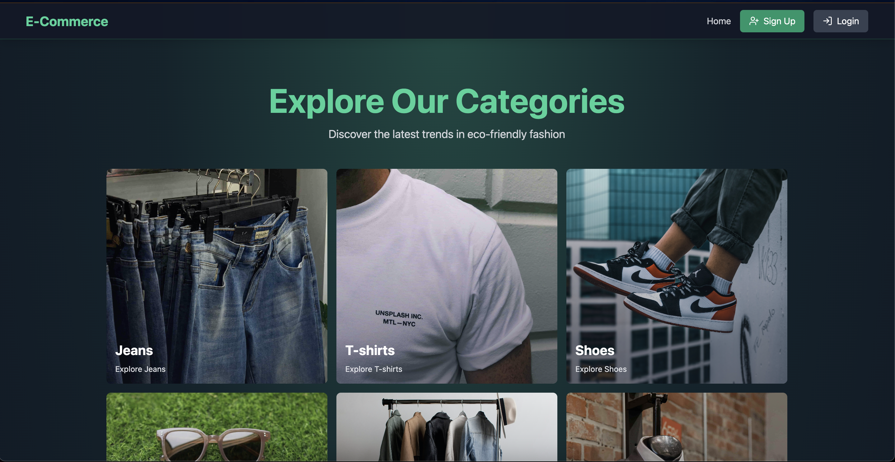
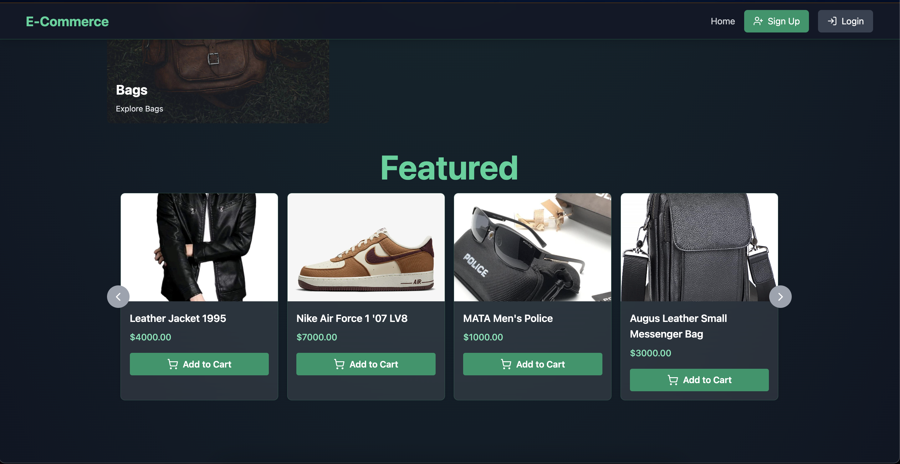
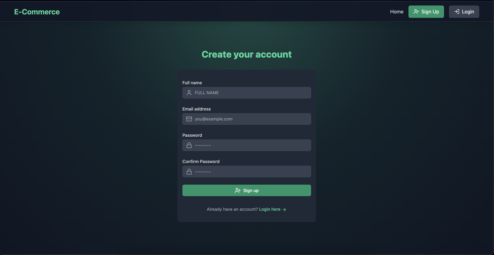
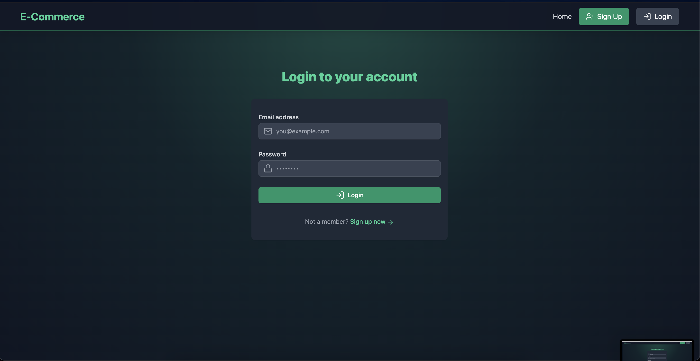
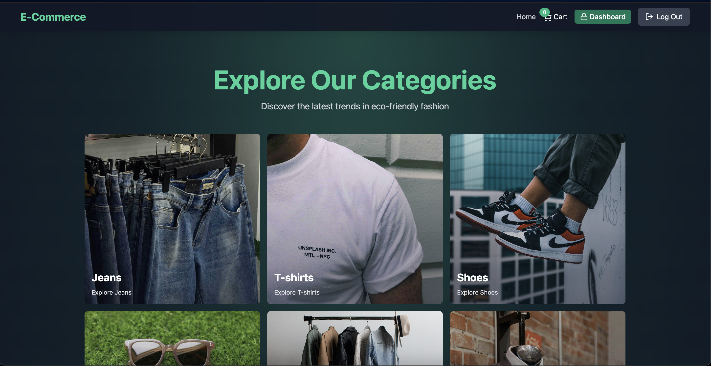
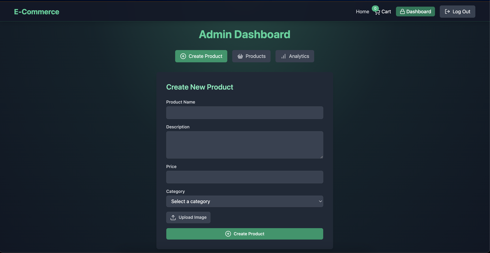
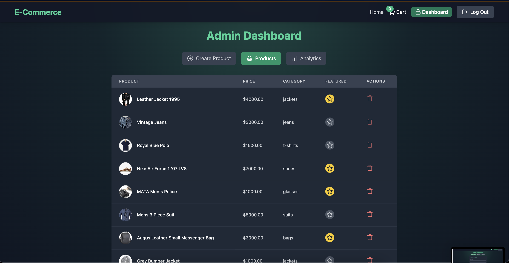
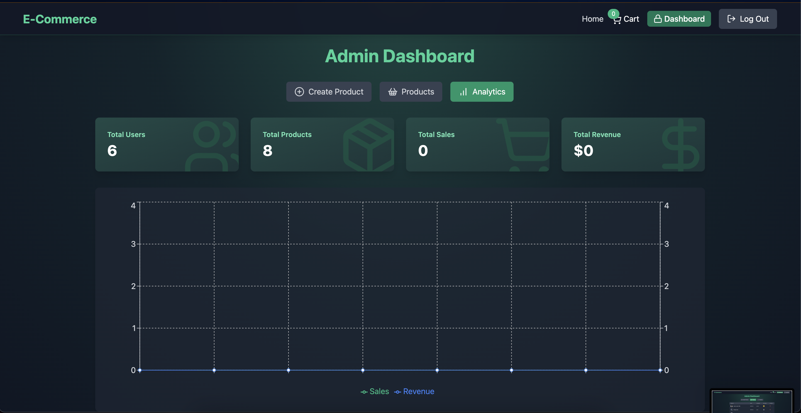
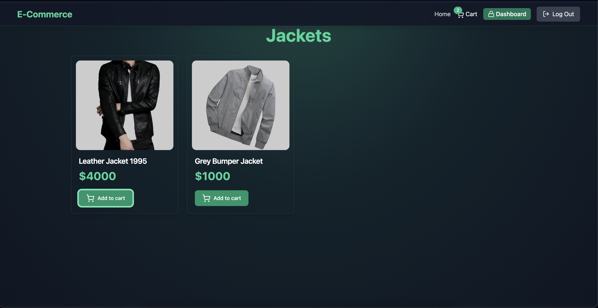
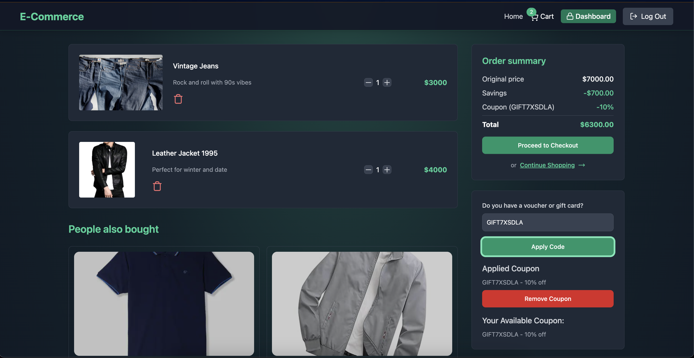
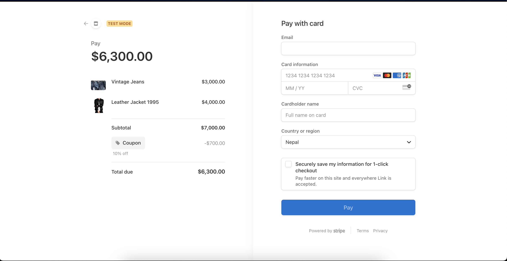

## 🚀 Features

- **Project Setup**
- **MongoDB & Redis Integration**
- **Stripe Payment Setup**
- **Robust Authentication System**
- **JWT with Refresh/Access Tokens**
- **User Signup & Login**
- **E-Commerce Core**
- **Product & Category Management**
- **Shopping Cart Functionality**
- **Checkout with Stripe**
- **Coupon Code System**
- **Admin Dashboard**
- **Sales Analytics**
- **Design with Tailwind**
- **Cart & Checkout Process**
- **Security & Data Protection**
- **Caching with Redis**
- **... and much more!**
